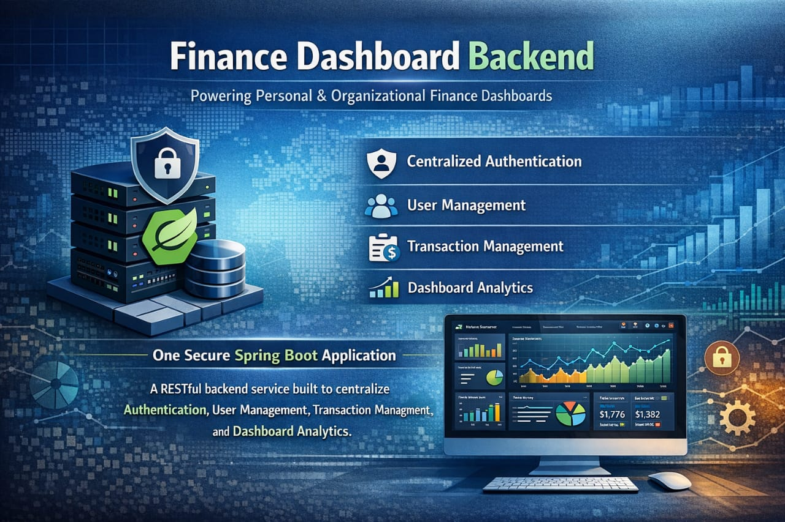

# Finance Dashboard Backend

A production-grade RESTful backend for a personal and organizational finance dashboard.
Built with Java 17 and Spring Boot, it handles authentication, role-based access control,
transaction management, and real-time analytics — all in one clean, layered architecture.

---

## 2. Tech Stack

| Technology      | Version                      | Purpose                                                                 |
|-----------------|------------------------------|-------------------------------------------------------------------------|
| Java            | 17                           | Core programming language                                               |
| Spring Boot     | 3.2.0                        | Application framework for REST APIs and service configuration           |
| Spring Security | 6.x (via Spring Boot 3.2.0)  | Authentication, JWT filter chain, and method-level access control       |
| MySQL           | 8.x                          | Relational database for persistent storage                              |
| JWT (jjwt)      | 0.11.5                       | Stateless token-based authentication and request authorization          |
| Lombok          | Latest compatible            | Reduces boilerplate for DTOs and entities                               |
| Maven           | 3.9+                         | Dependency management and build lifecycle                               |

---

## 3. Architecture Overview

The project follows a strict layered architecture. HTTP requests enter the **Controller** layer,
business rules are processed in the **Service** layer, persistence is managed through the
**Repository** layer, and data is stored in **MySQL**. This separation keeps responsibilities
clear, improves maintainability, and makes testing and future extension straightforward.

```
src/main/java/com/finance/dashboard/
├── config/          → SecurityConfig, DataSeeder
├── controller/      → AuthController, TransactionController,
│                       UserController, DashboardController
├── dto/
│   ├── request/     → RegisterRequest, LoginRequest, TransactionRequest
│   └── response/    → AuthResponse, ApiResponse, TransactionResponse,
│                       DashboardSummaryResponse, CategorySummaryResponse,
│                       MonthlyTrendResponse, RecentTransactionResponse
├── enums/           → Role, TransactionType
├── exception/       → GlobalExceptionHandler, ResourceNotFoundException
├── model/           → User, Transaction
├── repository/      → UserRepository, TransactionRepository
├── security/        → JwtUtil, JwtAuthFilter, CustomUserDetailsService
└── service/         → AuthService, TransactionService,
                        UserService, DashboardService
```

---

## 4. Database Setup

**Step 1** — Make sure MySQL is installed and running on port 3306.

**Step 2** — Create the database:
```sql
CREATE DATABASE finance_db;
```

**Step 3** — Start the application. Hibernate is configured with `ddl-auto=update`,
so all tables are created automatically on first run.

**Step 4** — No manual SQL migration scripts are required.

---

## 5. Configuration

Create or update `src/main/resources/application.properties`:

```properties
server.port=8080
spring.application.name=finance-dashboard

spring.datasource.url=jdbc:mysql://localhost:3306/finance_db?useSSL=false&serverTimezone=UTC&allowPublicKeyRetrieval=true
spring.datasource.username=root
spring.datasource.password=root1234
spring.datasource.driver-class-name=com.mysql.cj.jdbc.Driver

spring.jpa.hibernate.ddl-auto=update
spring.jpa.show-sql=true
spring.jpa.properties.hibernate.dialect=org.hibernate.dialect.MySQLDialect
spring.jpa.properties.hibernate.format_sql=true

app.jwt.secret=FinanceDashboardSecretKey2024SuperSecureLongStringForHMACSHA256
app.jwt.expiration=86400000
```

> **Note:** In production, move the JWT secret and DB credentials to environment variables
> and never commit them to version control.

---

## 6. How to Run

**Step 1** — Clone the repository:
```bash
git clone https://github.com/<your-username>/finance-dashboard.git
cd finance-dashboard
```

**Step 2** — Create the database (see Database Setup above).

**Step 3** — Run the application:
```bash
mvn spring-boot:run
```

**Step 4** — The service starts at:
```
http://localhost:8080
```

**Step 5** — On first startup, three test users are seeded automatically across all roles.
Use them to test role-specific behavior immediately.

---

## 7. Default Users (Auto-seeded on Startup)

| Name         | Email              | Password      | Role    |
|--------------|--------------------|---------------|---------|
| Super Admin  | admin@finance.com  | Admin@1234    | ADMIN   |
| Test Viewer  | viewer@finance.com | Viewer@1234   | VIEWER  |
| Test Analyst | analyst@finance.com| Analyst@1234  | ANALYST |

> These users are created automatically on first startup via `DataSeeder`.
> Use the Admin credentials to obtain a JWT token and test all endpoints.

---

## 8. Role Permissions Matrix

| Action                    | VIEWER | ANALYST | ADMIN |
|---------------------------|--------|---------|-------|
| Login / Register          | ✅     | ✅      | ✅    |
| View Transactions         | ✅     | ✅      | ✅    |
| Filter Transactions       | ✅     | ✅      | ✅    |
| View Dashboard Summary    | ✅     | ✅      | ✅    |
| View Category Breakdown   | ✅     | ✅      | ✅    |
| View Monthly Trends       | ✅     | ✅      | ✅    |
| Create Transaction        | ❌     | ❌      | ✅    |
| Update Transaction        | ❌     | ❌      | ✅    |
| Delete Transaction (soft) | ❌     | ❌      | ✅    |
| View All Users            | ❌     | ❌      | ✅    |
| Update User Role          | ❌     | ❌      | ✅    |
| Update User Status        | ❌     | ❌      | ✅    |

---

## 9. API Documentation

### 9.1 Authentication (No token required)

| Method | Endpoint            | Access | Description                  |
|--------|---------------------|--------|------------------------------|
| POST   | /api/auth/register  | Public | Register a new user          |
| POST   | /api/auth/login     | Public | Login and receive JWT token  |

### 9.2 Transaction APIs (Token required)

| Method | Endpoint                                              | Access | Description               |
|--------|-------------------------------------------------------|--------|---------------------------|
| POST   | /api/transactions                                     | ADMIN  | Create transaction         |
| GET    | /api/transactions                                     | All    | Get all transactions       |
| GET    | /api/transactions?type=INCOME                         | All    | Filter by type             |
| GET    | /api/transactions?category=Food                       | All    | Filter by category         |
| GET    | /api/transactions?startDate=2024-01-01&endDate=2024-12-31 | All | Filter by date range   |
| GET    | /api/transactions/paged?page=0&size=10                | All    | Paginated results          |
| GET    | /api/transactions/{id}                                | All    | Get single transaction     |
| PUT    | /api/transactions/{id}                                | ADMIN  | Update transaction         |
| DELETE | /api/transactions/{id}                                | ADMIN  | Soft delete transaction    |

### 9.3 Dashboard APIs (Token required)

| Method | Endpoint                        | Access | Description                        |
|--------|---------------------------------|--------|------------------------------------|
| GET    | /api/dashboard/summary          | All    | Full summary with all analytics    |
| GET    | /api/dashboard/summary/range    | All    | Summary filtered by date range     |
| GET    | /api/dashboard/categories       | All    | Category-wise income/expense totals|
| GET    | /api/dashboard/trends/monthly   | All    | Month-wise income/expense breakdown|
| GET    | /api/dashboard/recent           | All    | Recent transactions (default 10)   |
| GET    | /api/dashboard/recent?limit=5   | All    | Recent transactions (custom limit) |

### 9.4 User Management APIs (Token required — ADMIN only)

| Method | Endpoint                              | Access | Description              |
|--------|---------------------------------------|--------|--------------------------|
| GET    | /api/users                            | ADMIN  | Get all users            |
| PUT    | /api/users/{id}/role?role=ANALYST     | ADMIN  | Update user role         |
| PUT    | /api/users/{id}/status?isActive=false | ADMIN  | Activate/deactivate user |

---

## 10. Request and Response Examples

### Register
```json
POST /api/auth/register
Content-Type: application/json

{
  "name": "John Doe",
  "email": "john@example.com",
  "password": "pass123",
  "role": "VIEWER"
}
```
```json
{
  "status": 200,
  "message": "User registered successfully",
  "data": {
    "token": "<jwt-token>",
    "email": "john@example.com",
    "name": "John Doe",
    "role": "VIEWER"
  }
}
```

### Login
```json
POST /api/auth/login
Content-Type: application/json

{
  "email": "admin@finance.com",
  "password": "Admin@1234"
}
```
```json
{
  "status": 200,
  "message": "Login successful",
  "data": {
    "token": "<jwt-token>",
    "email": "admin@finance.com",
    "name": "Super Admin",
    "role": "ADMIN"
  }
}
```

### Create Transaction
```json
POST /api/transactions
Authorization: Bearer <token>
Content-Type: application/json

{
  "amount": 50000,
  "type": "INCOME",
  "category": "Salary",
  "date": "2024-03-01",
  "notes": "March salary"
}
```
```json
{
  "status": 201,
  "message": "Transaction created",
  "data": {
    "id": 1,
    "amount": 50000,
    "type": "INCOME",
    "category": "Salary",
    "date": "2024-03-01",
    "notes": "March salary",
    "createdBy": "Super Admin",
    "createdAt": "2024-03-01T10:00:00"
  }
}
```

### Dashboard Summary
```json
GET /api/dashboard/summary
Authorization: Bearer <token>
```
```json
{
  "status": 200,
  "message": "Dashboard summary fetched",
  "data": {
    "totalIncome": 50000,
    "totalExpense": 9500,
    "netBalance": 40500,
    "totalTransactions": 3,
    "totalIncomeCount": 1,
    "totalExpenseCount": 2,
    "categoryBreakdown": [
      { "category": "Salary", "type": "INCOME", "total": 50000 },
      { "category": "Rent",   "type": "EXPENSE", "total": 8000 },
      { "category": "Food",   "type": "EXPENSE", "total": 1500 }
    ],
    "monthlyTrends": [
      { "year": 2024, "month": 3, "monthName": "March", "type": "INCOME",  "total": 50000 },
      { "year": 2024, "month": 3, "monthName": "March", "type": "EXPENSE", "total": 9500  }
    ],
    "recentTransactions": [
      {
        "id": 3,
        "amount": 1500,
        "type": "EXPENSE",
        "category": "Food",
        "date": "2024-03-12",
        "notes": "Groceries",
        "createdBy": "Super Admin",
        "createdAt": "2024-03-12T18:25:40"
      }
    ]
  }
}
```

---

## 11. Error Handling

All errors return a consistent JSON shape through a centralized `GlobalExceptionHandler`.
This means frontend clients implement a single error-handling workflow regardless of the
error type. Spring Security handles 401 and 403 responses automatically when token or
role checks fail.

| Scenario               | HTTP Status | Message Example                          |
|------------------------|-------------|------------------------------------------|
| Resource not found     | 404         | Transaction not found with id: 5         |
| Validation failed      | 400         | amount must not be null                  |
| Unauthenticated        | 401         | Unauthorized                             |
| Insufficient role      | 403         | Forbidden                                |
| Duplicate email        | 400         | Email already registered: john@example.com |
| Server error           | 500         | Internal server error                    |

All error responses follow this format:
```json
{
  "status": 400,
  "message": "Validation failed",
  "data": null
}
```

---

## 12. Key Design Decisions

**1. Soft Delete**
Transactions are never permanently deleted. The `isDeleted` flag is set to `true` and all
queries filter it out automatically. This preserves financial history, supports auditability,
and makes deletions reversible.

**2. DTO Pattern**
Entities are never returned directly from controllers. DTOs decouple the API contract from
the database schema, prevent leaking internal fields like passwords, and allow response
shaping for analytics endpoints without modifying core entities.

**3. Constructor Injection**
All dependencies use constructor injection instead of field injection. This makes
dependencies explicit and immutable, improves testability with mocked collaborators,
and aligns with Spring best practices.

**4. Role-based Access via @PreAuthorize**
Access control is enforced at the method level using `@PreAuthorize` with `hasAuthority`
and `hasAnyAuthority`. This keeps security logic declarative, close to endpoint definitions,
and completely separate from business logic.

**5. Smart Filter Routing in TransactionService**
The `getAllTransactions` method uses a deterministic if-else chain to call the most specific
repository query based on which filter parameters are provided. This avoids broad queries
and keeps filter behavior predictable.

**6. Auto-seeded Test Users**
`DataSeeder` creates one user per role on startup automatically. This removes setup friction
and ensures every role's access behavior can be tested immediately without manual setup.

---

## 13. Assumptions Made

1. JWT authentication with 24-hour token expiry is sufficient; refresh token flow is out of scope.
2. All monetary values use `BigDecimal` to ensure financial precision and avoid floating point errors.
3. Soft delete is the only deletion strategy to preserve historical records and audit continuity.
4. Role is assigned at registration and can only be changed afterward by an Admin.
5. Transaction category is free text rather than a normalized table to keep implementation flexible.
6. Email verification is not implemented as this project focuses on backend API and business logic.

---

## 14. What Could Be Added in Production

1. Refresh token support and server-side token revocation for stronger session control
2. Email verification and password reset workflows
3. Audit log table tracking who changed what and when
4. Rate limiting and brute-force protection on auth endpoints
5. Pagination and sorting across all list endpoints
6. Full-text search on transaction notes and descriptions
7. CSV and PDF export for financial statements
8. Unit and integration tests with JUnit, Mockito, and Testcontainers
9. Swagger/OpenAPI documentation with bearer auth support
10. Docker and docker-compose setup for reproducible local and deployment environments

---

## 15. Author

Built by **Abubakar Chanda**
- GitHub: [github.com/arshsnaz](https://github.com/arshsnaz)
- Portfolio: [arshsnaz.github.io/portfolio/](https://arshsnaz.github.io/portfolio/) now make changes accordingly

**Step 2** — Create the database (see Database Setup above).

**Step 3** — Run the application:
```bash
mvn spring-boot:run
```

**Step 4** — The service starts at:
```
http://localhost:8080
```

**Step 5** — On first startup, three test users are seeded automatically across all roles.
Use them to test role-specific behavior immediately.

---

## 7. Default Users (Auto-seeded on Startup)

| Name         | Email              | Password      | Role    |
|--------------|--------------------|---------------|---------|
| Super Admin  | admin@finance.com  | Admin@1234    | ADMIN   |
| Test Viewer  | viewer@finance.com | Viewer@1234   | VIEWER  |
| Test Analyst | analyst@finance.com| Analyst@1234  | ANALYST |

> These users are created automatically on first startup via `DataSeeder`.
> Use the Admin credentials to obtain a JWT token and test all endpoints.

---

## 8. Role Permissions Matrix

| Action                    | VIEWER | ANALYST | ADMIN |
|---------------------------|--------|---------|-------|
| Login / Register          | ✅     | ✅      | ✅    |
| View Transactions         | ✅     | ✅      | ✅    |
| Filter Transactions       | ✅     | ✅      | ✅    |
| View Dashboard Summary    | ✅     | ✅      | ✅    |
| View Category Breakdown   | ✅     | ✅      | ✅    |
| View Monthly Trends       | ✅     | ✅      | ✅    |
| Create Transaction        | ❌     | ❌      | ✅    |
| Update Transaction        | ❌     | ❌      | ✅    |
| Delete Transaction (soft) | ❌     | ❌      | ✅    |
| View All Users            | ❌     | ❌      | ✅    |
| Update User Role          | ❌     | ❌      | ✅    |
| Update User Status        | ❌     | ❌      | ✅    |

---

## 9. API Documentation

### 9.1 Authentication (No token required)

| Method | Endpoint            | Access | Description                  |
|--------|---------------------|--------|------------------------------|
| POST   | /api/auth/register  | Public | Register a new user          |
| POST   | /api/auth/login     | Public | Login and receive JWT token  |

### 9.2 Transaction APIs (Token required)

| Method | Endpoint                                              | Access | Description               |
|--------|-------------------------------------------------------|--------|---------------------------|
| POST   | /api/transactions                                     | ADMIN  | Create transaction         |
| GET    | /api/transactions                                     | All    | Get all transactions       |
| GET    | /api/transactions?type=INCOME                         | All    | Filter by type             |
| GET    | /api/transactions?category=Food                       | All    | Filter by category         |
| GET    | /api/transactions?startDate=2024-01-01&endDate=2024-12-31 | All | Filter by date range   |
| GET    | /api/transactions/paged?page=0&size=10                | All    | Paginated results          |
| GET    | /api/transactions/{id}                                | All    | Get single transaction     |
| PUT    | /api/transactions/{id}                                | ADMIN  | Update transaction         |
| DELETE | /api/transactions/{id}                                | ADMIN  | Soft delete transaction    |

### 9.3 Dashboard APIs (Token required)

| Method | Endpoint                        | Access | Description                        |
|--------|---------------------------------|--------|------------------------------------|
| GET    | /api/dashboard/summary          | All    | Full summary with all analytics    |
| GET    | /api/dashboard/summary/range    | All    | Summary filtered by date range     |
| GET    | /api/dashboard/categories       | All    | Category-wise income/expense totals|
| GET    | /api/dashboard/trends/monthly   | All    | Month-wise income/expense breakdown|
| GET    | /api/dashboard/recent           | All    | Recent transactions (default 10)   |
| GET    | /api/dashboard/recent?limit=5   | All    | Recent transactions (custom limit) |

### 9.4 User Management APIs (Token required — ADMIN only)

| Method | Endpoint                              | Access | Description              |
|--------|---------------------------------------|--------|--------------------------|
| GET    | /api/users                            | ADMIN  | Get all users            |
| PUT    | /api/users/{id}/role?role=ANALYST     | ADMIN  | Update user role         |
| PUT    | /api/users/{id}/status?isActive=false | ADMIN  | Activate/deactivate user |

---

## 10. Request and Response Examples

### Register
```json
POST /api/auth/register
Content-Type: application/json

{
  "name": "John Doe",
  "email": "john@example.com",
  "password": "pass123",
  "role": "VIEWER"
}
```
```json
{
  "status": 200,
  "message": "User registered successfully",
  "data": {
    "token": "<jwt-token>",
    "email": "john@example.com",
    "name": "John Doe",
    "role": "VIEWER"
  }
}
```

### Login
```json
POST /api/auth/login
Content-Type: application/json

{
  "email": "admin@finance.com",
  "password": "Admin@1234"
}
```
```json
{
  "status": 200,
  "message": "Login successful",
  "data": {
    "token": "<jwt-token>",
    "email": "admin@finance.com",
    "name": "Super Admin",
    "role": "ADMIN"
  }
}
```

### Create Transaction
```json
POST /api/transactions
Authorization: Bearer <token>
Content-Type: application/json

{
  "amount": 50000,
  "type": "INCOME",
  "category": "Salary",
  "date": "2024-03-01",
  "notes": "March salary"
}
```
```json
{
  "status": 201,
  "message": "Transaction created",
  "data": {
    "id": 1,
    "amount": 50000,
    "type": "INCOME",
    "category": "Salary",
    "date": "2024-03-01",
    "notes": "March salary",
    "createdBy": "Super Admin",
    "createdAt": "2024-03-01T10:00:00"
  }
}
```

### Dashboard Summary
```json
GET /api/dashboard/summary
Authorization: Bearer <token>
```
```json
{
  "status": 200,
  "message": "Dashboard summary fetched",
  "data": {
    "totalIncome": 50000,
    "totalExpense": 9500,
    "netBalance": 40500,
    "totalTransactions": 3,
    "totalIncomeCount": 1,
    "totalExpenseCount": 2,
    "categoryBreakdown": [
      { "category": "Salary", "type": "INCOME", "total": 50000 },
      { "category": "Rent",   "type": "EXPENSE", "total": 8000 },
      { "category": "Food",   "type": "EXPENSE", "total": 1500 }
    ],
    "monthlyTrends": [
      { "year": 2024, "month": 3, "monthName": "March", "type": "INCOME",  "total": 50000 },
      { "year": 2024, "month": 3, "monthName": "March", "type": "EXPENSE", "total": 9500  }
    ],
    "recentTransactions": [
      {
        "id": 3,
        "amount": 1500,
        "type": "EXPENSE",
        "category": "Food",
        "date": "2024-03-12",
        "notes": "Groceries",
        "createdBy": "Super Admin",
        "createdAt": "2024-03-12T18:25:40"
      }
    ]
  }
}
```

---

## 11. Error Handling

All errors return a consistent JSON shape through a centralized `GlobalExceptionHandler`.
This means frontend clients implement a single error-handling workflow regardless of the
error type. Spring Security handles 401 and 403 responses automatically when token or
role checks fail.

| Scenario               | HTTP Status | Message Example                          |
|------------------------|-------------|------------------------------------------|
| Resource not found     | 404         | Transaction not found with id: 5         |
| Validation failed      | 400         | amount must not be null                  |
| Unauthenticated        | 401         | Unauthorized                             |
| Insufficient role      | 403         | Forbidden                                |
| Duplicate email        | 400         | Email already registered: john@example.com |
| Server error           | 500         | Internal server error                    |

All error responses follow this format:
```json
{
  "status": 400,
  "message": "Validation failed",
  "data": null
}
```

---

## 12. Key Design Decisions

**1. Soft Delete**
Transactions are never permanently deleted. The `isDeleted` flag is set to `true` and all
queries filter it out automatically. This preserves financial history, supports auditability,
and makes deletions reversible.

**2. DTO Pattern**
Entities are never returned directly from controllers. DTOs decouple the API contract from
the database schema, prevent leaking internal fields like passwords, and allow response
shaping for analytics endpoints without modifying core entities.

**3. Constructor Injection**
All dependencies use constructor injection instead of field injection. This makes
dependencies explicit and immutable, improves testability with mocked collaborators,
and aligns with Spring best practices.

**4. Role-based Access via @PreAuthorize**
Access control is enforced at the method level using `@PreAuthorize` with `hasAuthority`
and `hasAnyAuthority`. This keeps security logic declarative, close to endpoint definitions,
and completely separate from business logic.

**5. Smart Filter Routing in TransactionService**
The `getAllTransactions` method uses a deterministic if-else chain to call the most specific
repository query based on which filter parameters are provided. This avoids broad queries
and keeps filter behavior predictable.

**6. Auto-seeded Test Users**
`DataSeeder` creates one user per role on startup automatically. This removes setup friction
and ensures every role's access behavior can be tested immediately without manual setup.

---

## 13. Assumptions Made

1. JWT authentication with 24-hour token expiry is sufficient; refresh token flow is out of scope.
2. All monetary values use `BigDecimal` to ensure financial precision and avoid floating point errors.
3. Soft delete is the only deletion strategy to preserve historical records and audit continuity.
4. Role is assigned at registration and can only be changed afterward by an Admin.
5. Transaction category is free text rather than a normalized table to keep implementation flexible.
6. Email verification is not implemented as this project focuses on backend API and business logic.

---

## 14. What Could Be Added in Production

1. Refresh token support and server-side token revocation for stronger session control
2. Email verification and password reset workflows
3. Audit log table tracking who changed what and when
4. Rate limiting and brute-force protection on auth endpoints
5. Pagination and sorting across all list endpoints
6. Full-text search on transaction notes and descriptions
7. CSV and PDF export for financial statements
8. Unit and integration tests with JUnit, Mockito, and Testcontainers
9. Swagger/OpenAPI documentation with bearer auth support
10. Docker and docker-compose setup for reproducible local and deployment environments

---

## 15. Author

Built by **Abubakar Chanda**
- GitHub: [github.com/arshsnaz](https://github.com/arshsnaz)
- Portfolio: [arshsnaz.github.io/portfolio](https://arshsnaz.github.io/portfolio/) now make changes accordingly
